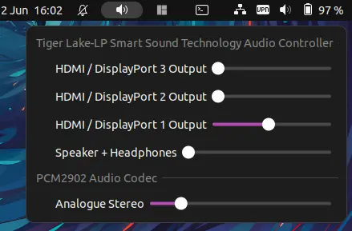

# Advanced volume control

A GNOME Shell extension providing volume control for multiple devices.

As discussed on the [Linux Matters podcast](https://linuxmatters.sh/).

Get it from the [GNOME Extensions](https://extensions.gnome.org/extension/6036/advanced-volume-control/) site.

When active, this extension adds an indicator to your top panel. When clicked, a menu is displayed listing all audio outputs
detected by pulseaudio, and allows the volume to be set for each with a slider

